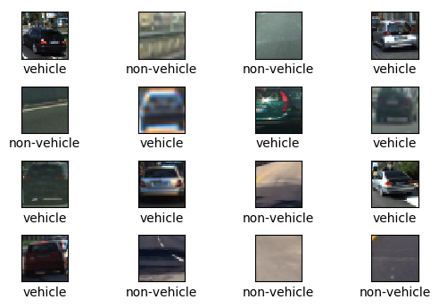
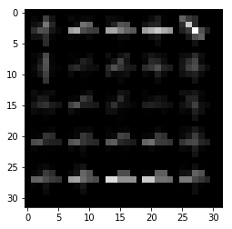
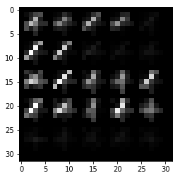
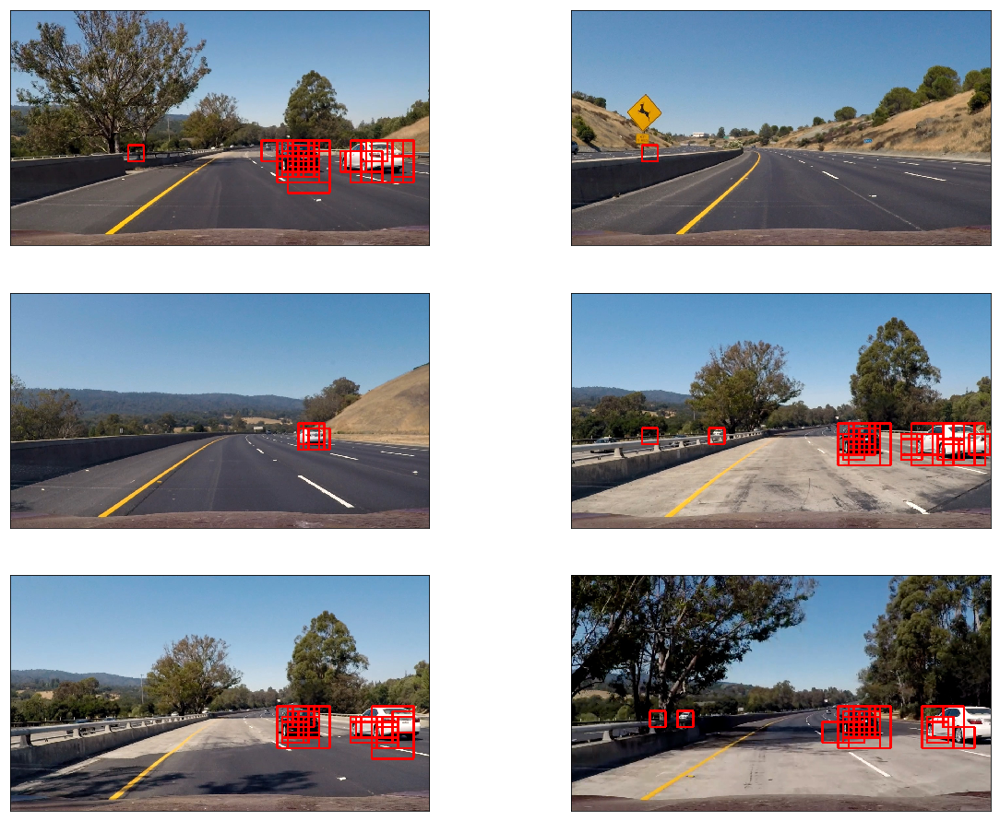
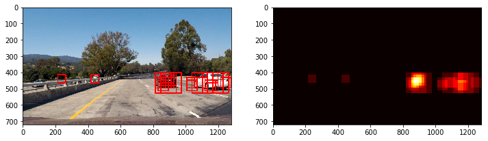
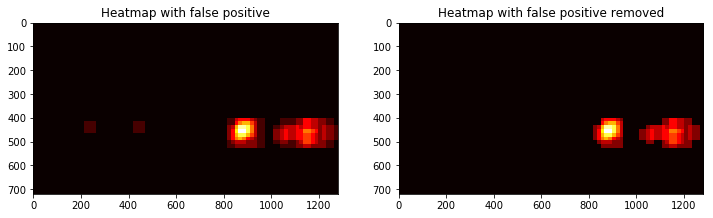
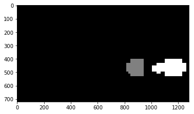
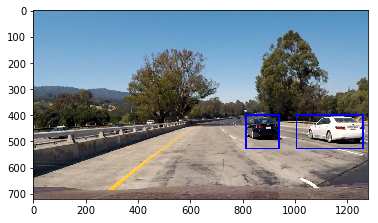

# Vehicle Detection and Tracking

### The goals / steps of this project are the following:
* Read the data set containing vehicles and non-vehicles images.
* Extract histogram of gradient (HOG) features using a proper color channel.
* Spatial distribution of colors (binned color features) and histogram of colors may also be applied.
* Use a LinearSVC or a SVC(kernel='rbf') to classsify vehicles and non vehicles objects and evaluate accuracy score.
* Use a sliding window search technique to a region of interest frame by frame to detect vehicles.
* Use heatmap and thresolding to remove outliers and false positives.
* Predict the co-ordinates and draw a bounding box to each vehicles.
* Now apply the above steps to a video file and draw bounding boxes to each file.

**Environment specification :**

* OS used : Ubuntu Linux 16.04 LTS
* This project is done in python version 3.6.2 .
* Don't use python version < 3.6 . The f-string function will not work properly.
* Scikit learn version used => 0.19.0

## Discussions

**Reading the datasets and Explore data**:
---
                 
     1. Read the whole dataset using read_vnv_data() function for training.
     2. read_vnv_data() function uses ProcessPoolExecutor() for using all
        the number of cores available.
     
 **Sample Images randomly taken from the data set.**
 

After the above step I resize all the images by `cv2.resize()` from shape `64x64` to `32x32`. As we see this step will reduce
the number of pixels to 1/4th . The number of features extracted finally will also be reduced significantly.

**Feature extraction and choice of Hyperparameters.**
---
    For pixel wise spatial feature extraction bin_spatial() function is defined. It just returns 
    the color spaces stacked horizontally using numpy's ravel() function. 
    
    color_hist() function is used to return the features based on their color histogram distribution.
    
**Frankly speaking the above two functions do not contribute much more important features to increase the accuracy.
Here I only used hog features on a specific color space.**

**Choice of color space:** 
                   
    Here I used `YCrCb` color space . This space is basically used for digital video data
    transmission. Y space is the weighted sum of RGB space . This carries most of the luminance
    information of the image. I took Y space for extracting HOG features . AS this gives highest
    number of accuracy on test image set.
                   
**Extracting Hog features:**

    extract_features() function extracts hog features of Y space . Choosing a balanced set
    of hyperparameters is one of the main task . Here I used orientations = 8, 
    cells_per_block=(5, 5), pixels_per_cell=(6, 6). And that gives a total number of 200
    features. Which gives a test accuracy of 0.9809.
                    
    A parameter choice like orientations = 9, cells_per_block=(7, 7), pixels_per_cell=(8, 8)
    with a input size 64x64 gives 1768 hog features. With only a accuracy rise of 0.061.
    For this reason a trade off is made between number of features and accuracy rise. 1/8 th
    reduction of feature reduces extraction time proportionally. Which is indeed most important
    for real time feature extraction.
    
**Visualization of Hog features for a vehicle and non-vehicle image.**

 

 **Traning and accuracy prediction**
 
      For classification purpose Support vector classifier is used with 'rbf' kernel. Linear kernel
      may give important performance improvement for training time but accuracy obtained is more 
      than 4% lower in this case. 
      A 20% train-test split has been made. And shuffle of training data is necessary for reducing
      overfitting.
      The accuracy obtained is 98.09 is pretty good with only 200 HOG features. All x features used for 
      training and testing purpose are normalized.
      
**Sliding Window search and choice of multiple sized windows:**

       Here we discuss four finctions.
       
       1. draw_rect() function for drawing recatngle on images given end points of any diagonal.
       
       2. sliding_window_search()  function takes the three arguments. Basically sliding window
          search is done in the specific regions of a input image where the probability of finding
          vehicles is most. It takes square window size the overlap region and cropping regions and
          returns all the windows form the image.
          
       3. variable_sliding_window_search() function basically takes a input image array and a input 
          list named parameters. The list contains dictionaries which contains window_size, overlap_
          ratio, x and y values for cropping.
          
       4. predict_coords() function returns all the coordinates of the windows in which it predict
          vehicle. If visualize is set true then it also returns a image with all rectangles drawn.
       
       A total 3 windows are used . On the bottom right  windows of sizes 128px and 64px with a 
       overlap ratio .25 is used and for left bottom window size of 48px and overlap ratio of .25
       is used. 
       
       Parameters Used:
       [{'ypix_range': (400, 670), 'xpix_range': (750, 1280), 'window_size': (128, ), 'overlap': (.25, )},
        {'ypix_range': (415, 463), 'xpix_range': (0, 500), 'window_size': (48,), 'overlap': (0.25,)},
        {'ypix_range': (400, 570), 'xpix_range': (750, 1280), 'window_size': (64, ), 'overlap': (.25,)}]
       
       For 720x1280 sized image total number of windows found is 313.
       
**Rectangles Drawn on test images**

**As we can see the classifier detects many false positives.**

**Removal of false positives and a finding coordinates of a centered bounding box:**
       
        Basically around a vehicle more than 2 or 3 rectangles of different sizes are drawn. 
        But near a false positive one or maximum two rectangle can be seen.
        
        So first make a binary image called heatmap where the pixels inside the rectangles are 
        set to add 1 . Now if two rectangles detected then the pixel value of the common region
        will be 2.
        
        
**Test Image with multiple rectangles drawn and it's heatmap**

        
        Now apply a thresold on the binary image such that only those pixels kept where 2 or 
        more rectangles intersected. 
        
        
**Heatmap with it's thresolded version with a thresold one**

        Now we can find the number of vehicles and the pixels through scipy's label() function.
        
       

        
        Now draw a single rectangle containing the vehicle by draw_labeled_bboxes() function.
  
     
**Single rectangle drawn on a test image.**

**Pipeline Function**
---
Pipe line function `imfunc() ` is applied to the video frames. The link of output video is given below.

**[Output Video](./output.mp4)**

The pipe line function pass any kind of exception if raised during any situation. The thresold for heatmap is
set to 2. It detects all major vehicles very well but there are still many false positives which I can't remove.

**Limitations and Improvements proposal.**

        The pipeline here mainly based on the parameters for sliding window search. This is manually 
        chosen and suitable for only this case.
        
        For General case the lower half the image can be searched.
        
        Extraction of hog feature is generally a compute intensive work But as the number of windows increase the
        time required for vehicle detection. So it will not work for realtime case.
        
        There are many false positives in this kind of detection which is a major problem. 
 
